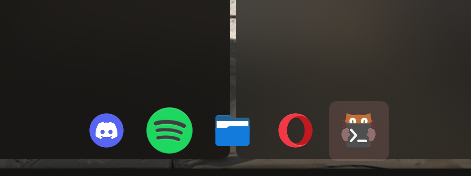
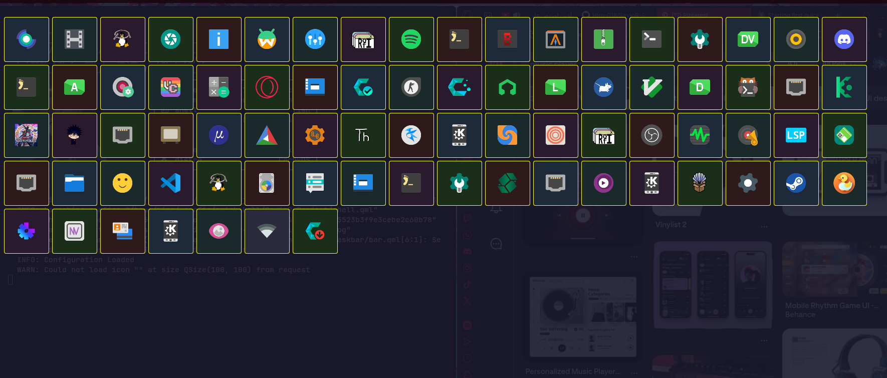

# SavioR

A game menu inspired Wayland shell built with Quickshell and QML, designed for Hyprland.

No top bar. Just vibes.

## Planned Features
- Floating icon dock with hover animations
- Custom media player
- Wallpaper selector
- Sound design
- Customized Kitty terminal
- Lots of hover elements and animations

## Dependencies
- Quickshell
- Hyprland (requires `wlr-foreign-toplevel-management`)

## Usage
```bash
quickshell -c ~/.config/quickshell/SavioR
```

## Preview
Dock:


Launcher (still missing a lot of things):


## Note
This is a personal project built around my own preferences.
Settings for customization by other users may come later — or not. We'll see.
